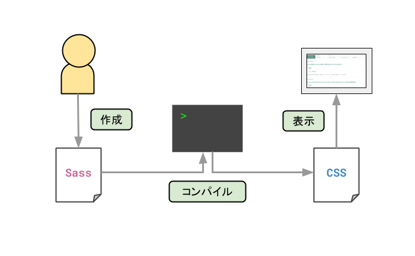

Sassという言葉をよく聞くようになったなぁと思います。

私もかなり使っているのですが、正直見様見真似で使ってきていました。

今後のために、一度整理する意味も込めて、Sass公式サイトの導入ページをまとめてみました。

* 公式サイト：[Sass: Syntactically Awesome Style Sheets](https://sass-lang.com/)
* 今回学習したページ：[Sass: Sass Basics](https://sass-lang.com/guide)

## Sassってこんなもの

Sassについて一言でまとめると、**記述が膨大になりがちなCSSの保守を楽にするための言語**です。

基本的にはSassファイルを直接読み込むのではなく、コンパイルしてCSSファイルに変換して読み込みます。



## 導入方法

Sassを導入するには下記のいずれかのコマンドを実行します。

```powershell:title=npm
npm install -g sass
```

```powershell:title=Chocolatey
choco install sass
```

```powershell:title=Homebrew
brew install sass / sass /sass
```

## SassからCSSへのコンパイル

下記のコマンドを実行すると作成済みのSassファイルをCSSにコンパイルできます。

```powershell
sass input.scss output.css
```

`--watch`フラグを使用すると、ファイルやディレクトリを監視して、ファイルが更新されたら自動でコンパイルし直します。

```powershell
sass --watch input.scss output.css
```

ディレクトリを監視する場合は、入力のディレクトリと出力のディレクトリを転んで区切ります。

```powershell
sass --watch app/sass:public/stylesheets
```

## 変数の定義

Sassでは変数を定義して、使い回すことができます。

変数を定義する場合は、変数名の先頭に`$`を書きます。

```scss:title=input.scss
$primary-color: #0f7dd6;

body {
    color: $primary-color;
}
```

このコードをCSSにコンパイルすると、次のように出力されます。

```css:title=output.css
body {
  color: #0f7dd6;
}
```

## タグのネスト

Sassではタグをネストすることができます。

```scss:title=input.scss
.btn-primary {
  background: #0f7dd6;
  color: #ffffff;
  border: none;
  
  &::focus {
      outline: none;
  }
```

このコードをCSSにコンパイルすると次の通り。

```css:title=output.css
.btn-primary {
  background: #0f7dd6;
  color: #ffffff;
  border: none;
}
.btn-primary::focus {
  outline: none;
}
.btn-primary:hover {
  background: #70b9f5;
  color: #ffffff;
}
```

親要素・子要素の記述や、セレクターを記述するときに便利です。

## パーツごとにソースコードを分割できる

`@use`を使って、分割したSassファイルを読み込むことができます。

※.scssであれば、CSSファイルも読み込めます。

```scss:title=\_base.scss
$primary-color: #0f7dd6;

body {
    color: $primary-color;
}
```

```scss:title=style.scss
@use 'base';

.inverse {
	background-color: base.$primary-color;
	color: #ffffff;
}
```

`as`で任意の名前空間をつけることも可能です。

```scss:title=\_var.scss
$primary-color: #0f7dd6;
```

```scss:title=style.scss
@use 'var' as v;
body {
	color: v.$primary-color;
}
```

`@forward`を使うと、読み込んだファイルの中の変数を他のファイルで読み込めるようになります。

```scss:title=\_var-color.scss
$primary-color: #0f7dd6;
```

```scss:title=\_var.scss
@forward 'var-color';
```

```scss:title=style.scss
@use 'var';

body {
	color: var.$primary-color;
}
```

### @importと@use、@forwardの違い

似た機能に@importがあります。違いを整理してみました。

* @import：ソースのコピペのようなイメージです。名前空間は指定せず、変数は使用するより前に読み込む必要があります。
* @use、@forward：名前空間を指定できます。読み込む先のファイルで必要な変数を読み込みます。

@importは近いうちに削除されることが決定しているようです。今からソースを作るのであれば、@use、@forwardを使うことをおすすめします。

## .scssと.sassの違い

Sassには拡張子が2種類あります。違いは**ソースコードの書き方のお作法**です。

* .scss：基本的にCSSと同じように記載できます。`{}`を記述します。
* .sass：インデントで記載します。`{}`は記述しません。

参考ページ：[Sass: Syntax](https://sass-lang.com/documentation/syntax)

## まだ理解できていないこと

学習用ページには`@mixin`と`@extend`についての説明もあったのですが、まだ私の理解力では追いつかず…でした。

とくに@extendは入れ子でソースを記述するのと何が違うの？？って感じです。

## まとめ

今までなんとなくで書いていたソースコードの意味や、.sassと.scssの違いが理解できてすっきりです。

全体の概要がなんとなく理解できたので、次はドキュメントを読み込んでさらに具体的な内容を理解します。