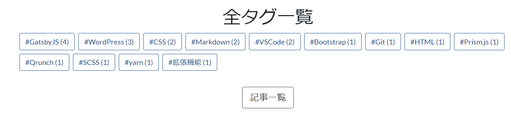

GatsbyJSのチュートリアルを参考に、タグ一覧ページを作成しました。

[Creating Tags Pages for Blog Posts | GatsbyJS](https://www.gatsbyjs.org/docs/adding-tags-and-categories-to-blog-posts/)

「このタグを投稿が多い順に並び替えられたら良いのにな～」と思って試行錯誤していたのですが、ようやく解決法が分かったので記事にまとめます。

JavaScriptの配列ソート機能を使うことで実現可能です。

## まずはタグ情報の取得

まずはタグに関する情報をGraphQLで取得します。

```tsx{8}
export const pageQuery = graphql`
  query PagesTags{
    allMarkdownRemark(
      limit: 2000
      ) {
      group(field: frontmatter___tags) {
        fieldValue
        totalCount
      }
    }
  }
`
```

この記述でマークダウンに記述した`tags:[]`に紐づくタグ情報を取得します。

`totalCount`で投稿数を取得するのをお忘れなく。

## 配列のソート機能で投稿数順に並び替える

allMarkdownRemarkのgroupは配列です。

なので、groupに対してソートをかけてあげます。

投稿数`totalCount`が多い順に並び替える場合、下記のように記述します。

```tsx
var sortedGroup = group.sort(function(a,b){
  return b.totalCount - a.totalCount
})
```

後は、投稿数順に並び替わった配列`sortedGroup`を元にHTMLに変換していきます。

## ソースコード全体像

タグ一覧ページ用のソースコード全体像はこんな感じです。

```tsx
import * as React from "react"
import { Link, graphql } from "gatsby"

import { PagesTagsQuery } from "../../types/graphql-types"

// Components
import Layout from "../components/layout"
import SEO from "../components/seo"
import BackToTopPage from "../components/back-to-top-page"

// Utilities
import { kebabCase } from "lodash"

type Props = {
  data : PagesTagsQuery
}

const TagsPage = ({
  data:{
    allMarkdownRemark:
    {group}
}}:Props)  => {

var sortedGroup = group.sort(function(a,b){
  return b.totalCount - a.totalCount
})

  return(
    <Layout>
      {SEO
        ("タグ一覧ページ",
        "全タグの一覧ページです")
      }
      <h1 className="text-center">全タグ一覧</h1>
      <div>
        <ul className="list-unstyled">
          {sortedGroup.map((tag, index:number) => (
            <li
              key={index}
              className="d-inline-block m-1"
            >
              <Link to={`/tags/${kebabCase(tag.fieldValue)}/`} className="btn btn-outline-primary">
                #{tag.fieldValue} ({tag.totalCount})
              </Link>
            </li>
          ))}
        </ul>
      </div>
      <BackToTopPage />  
    </Layout>
  )
}

export default TagsPage

export const pageQuery = graphql`
  query PagesTags{
    allMarkdownRemark(
      filter: {fields: {collection: {eq: "post"}}}
      limit: 2000
      ) {
      group(field: frontmatter___tags) {
        fieldValue
        totalCount
      }
    }
  }
`
```

sortGroupに対して`map`を指定してそれぞれのタグ投稿ページへのリンクを指定しています。

こうすることで、下記の画像のように投稿数が多い順にタグが並びます。



[[note]]
| 最近ソースコードのTypeScript化をしたので、GraphQL Code Generaterを使用して、GraphQLのクエリのタイプを取得しています。
|
| PropTypesで指定するよりも二度手間感がなく良いです。
|
| GraphQL Code Generaterについても近々記事にまとめようと思います。
|
| [GraphQL Code Generater](https://graphql-code-generator.com/)

## まとめ

今回はGatsbyJSのタグ一覧ページを投稿数順に並び替える方法の紹介でした。

個人的にはJavaScriptをしっかり学ばずにGatsbyJSに飛び込んでしまったので、結構初歩的なところでひっかかってしまたのかも……と感じています。

JavaScriptへの理解を深めてGatsbyJSとより仲良くしていきたいです！

今回はここまで。
