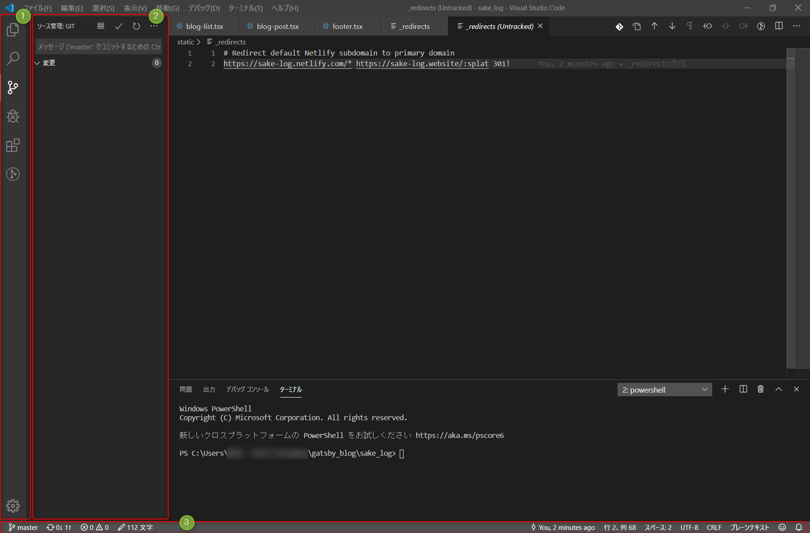
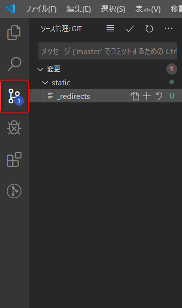
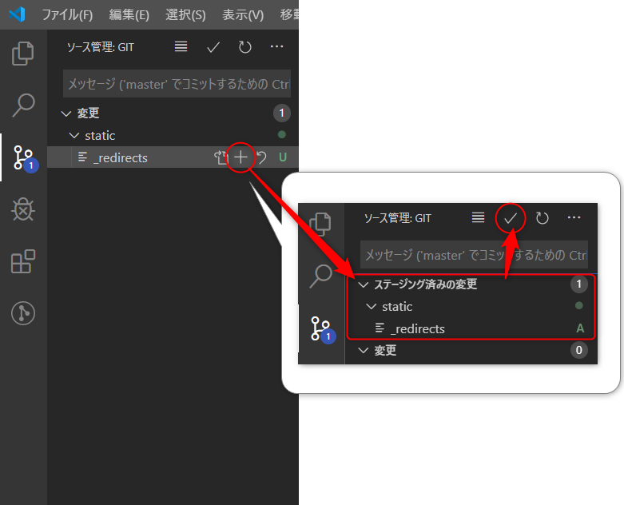
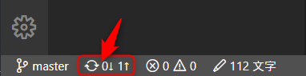
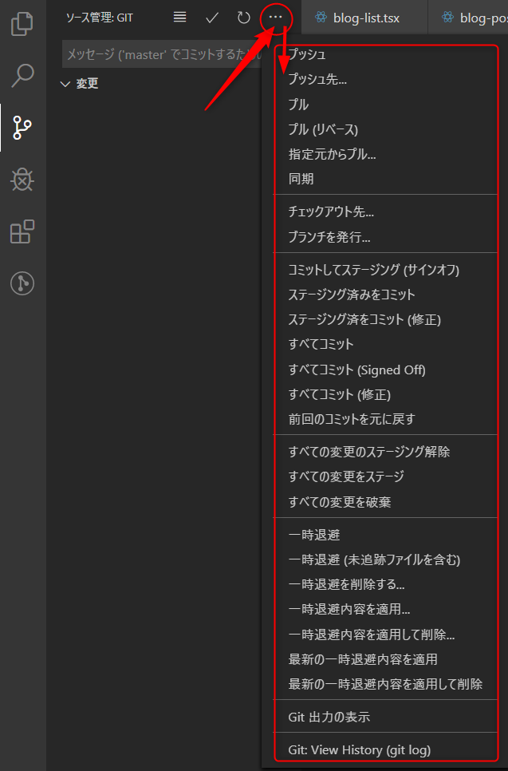

VSCodeの魅力をお伝えしていくシリーズです。

前回はこちら。

第一回：[VSCodeで快適な開発環境を～拡張機能編～](../../vscode-install-extension)

今回は、VSCodeを使うとGitでのソース管理がはかどるぞ！ということをお伝えします。

## GUI操作ではかどるぞ

VSCodeを使えばGitのコマンドをターミナルでほぼ叩かなくて良くなります。

正直必要なのはプロジェクト立ち上げ時の

```powershell
git init
```

ぐらいでしょうか。

具体的にVSCodeでGit管理する手順を見ていきましょう。

### 具体的な説明……の前にまずは全体像を



VSCodeの画面構成は上記のとおりになっています。

左端が「アクティビティバー」(1)、その隣が「サイドバー」(2)、一番下が「ステータスバー」(3)です。

今回は、この3つのエリアをポチポチして操作していきます。

### Gitでソース管理の画面表示

まずはGitでソース管理するための画面を表示しましょう。



アクティビティバーの「ソース管理」のアイコンをクリックします。

クリックすると、最後のコミットから変更があったソースが表示されます。

### 変更をステージングしてコミット

変更をステージングしてコミットしましょう。



変更をステージングしたいファイルの横の「＋」アイコンをクリックすると、変更がステージングされます。

上のチェックマークをクリックすると変更がコミットされます。

### コミットした内容をリモートリポジトリにプッシュする

コミットした内容をリモートリポジトリにプッシュしましょう。

ステータスバーで操作可能です。



ステータスバーの「変更を同期」（上記画像の赤枠箇所）をクリック。

この操作だけでリモートリポジトリにプッシュ可能です。

[[note]]
|もちろん、プッシュする前にリモートリポジトリとの接続が必要です。接続方法は次の章を参照してください。

### その他こんなことがGUIで完結するぞ

他にも、こんなことがGUIで完結します。



例えば、リモートリポジトリの追加は「プッシュ先」で指定可能です。

クリックするとコマンドパネルが立ち上がるので、指示に従って操作すればターミナルを叩かなくてもリモートリポジトリの追加が可能です。便利。

## まとめ

今回は、VSCodeはGit管理もGUIで完結できて便利なんだよ～というお話でした。

元々私はソース管理自体きちんとしてこなかったのですが、VSCodeで楽に管理できるので、Gitでソース管理をする習慣づけになりました。

標準の機能以外にも、Git管理を便利にする拡張機能もありますので、是非VSCodeでGit管理、はじめてみてはいかがでしょうか。

今回はここまで。
