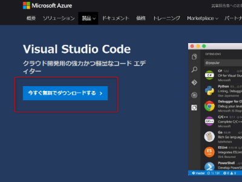
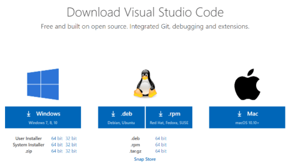
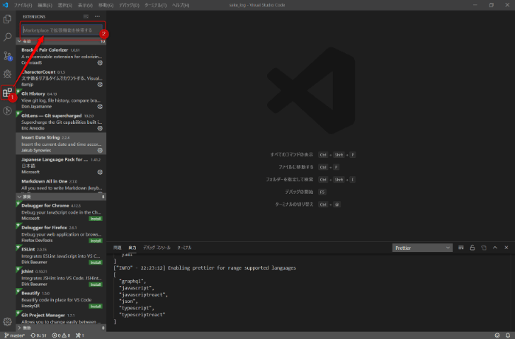
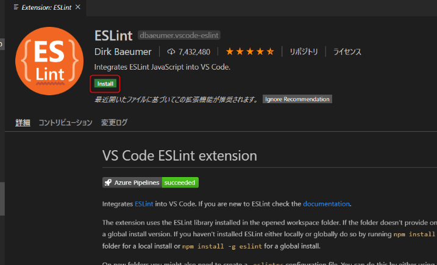

みなさん、ソースは何で書いていますか？

ネットでよくオススメされているな～と感じる**VSCode**。

実際使ってみると快適だったので、数回に分けて魅力やできることをお伝えしていきたいと思います。

今回は導入の仕方と拡張機能について説明します。

## VSCodeとはなんぞや

Microsoftが開発しているソースコードエディタです。

正式名称はVisual Studio Codeです。

macOS、Windows、Linuxで動きます。

### VSCodeでできること

- フォルダを開いて、プロジェクト内のファイルを行き来して作業できる
- Git管理がGUI化されてやりやすくなる
- 便利な拡張機能でエディタをカスタマイズ
- 配色テーマやアイコンテーマで見た目を自分好みに
- マークダウンをプレビュー表示しながら書ける

### 実際にインストールしてみる

では、実際にVSCodeをインストールしてみましょう。

[Visual Studio Code](https://azure.microsoft.com/ja-jp/products/visual-studio-code/)にアクセスして、インストーラーをダウンロードします。

「**今すぐ無料でダウンロードする**」をクリック。

あとは画面の指示に従ってインストールを進めます。

## 拡張機能のインストールの仕方

Visual Studio Codeの魅力の1つが様々な拡張機能を入れられることです。

拡張機能のインストールはとても簡単です。

1. 拡張機能のアイコンをクリック
2. 検索フォームで検索
3. Installをクリック

## おすすめの拡張機能

少し偏りがありますが、私が実際に入れているおすすめの拡張機能を紹介します。

### 日本語入力編

#### Japanese Language Pack for Visual Studio Code

VSCodeのUIを日本語化するのに必要です。

これはインストール必須ではないでしょうか。

[Japanese Language Pack for Visual Studio Code](https://marketplace.visualstudio.com/items?itemName=MS-CEINTL.vscode-language-pack-ja)

### 開発補助全般

#### Bracket Pair Colorizer

閉じタグを色分けして、どのタグと紐付いているのかわかりやすくします。

[Bracket Pair Colorizer](https://marketplace.visualstudio.com/items?itemName=CoenraadS.bracket-pair-colorizer)

#### Prettier

コードのフォーマットを整えます。

※インデントの揃え等

Visual Studio Codeの拡張機能を使うとボタン一発でフォーマットを整えてくれて便利です。

[Prettier - Code formatter](https://marketplace.visualstudio.com/items?itemName=esbenp.prettier-vscode)

### マークダウン編

#### Markdown All in One

マークダウンで文書を作成するのに便利な機能全部入りです。

例えばショートカットで太字化、URLを文字の上に貼り付けるだけでリンクの記載に直してくれるなど。

VSCodeでマークダウンを書くなら入れておいて損はないです。

[Markdown All in One](https://marketplace.visualstudio.com/items?itemName=yzhang.markdown-all-in-one)

#### markdownlint

入れておくとMarkdownの文法を自動でチェックしてくれます。

[markdownlint](https://marketplace.visualstudio.com/items?itemName=DavidAnson.vscode-markdownlint)

### 文書作成補助

#### Insert Date String

ショートカットキー`ctrl+shift+I`で日付を一発で入力することができます。

主にブログ記事の投稿日挿入に使用しています。

[Insert Date String](https://marketplace.visualstudio.com/items?itemName=jsynowiec.vscode-insertdatestring)

#### CharacterCount

文書の文字数をリアルタイムでカウントしてくれます。

文字数はステータスバーに表示されます。

[CharacterCount](https://marketplace.visualstudio.com/items?itemName=8amjp.charactercount)

## まとめ

今回はVSCodeのご紹介でした。

高機能のコードエディタを使えば、効率的に開発をすすめることができます。

拡張機能便利なので、是非お気に入りの拡張機能を見つけてみてください。
