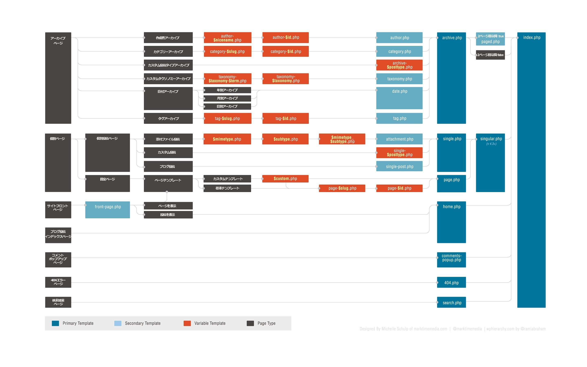

個人的に WordPress を勉強するのに一番適しているのは自作テーマを作ることだと思います。

だけど、WordPress のテーマ用ファイルって種類がたくさんで混乱してしまいます。

というわけで、今回は WordPress で自作テーマを作るのに最低限必要なファイルをご紹介します。

## これさえあれば大丈夫…なファイルの一覧

WordPress 公式にテーマファイルの階層についての図があるので、これを参考に、洗い出しをします。このファイルを作成すると、このページとして扱うよ～という一覧ですね。



[テンプレート階層 - WordPress Codex 日本語版](http://wpdocs.osdn.jp/%E3%83%86%E3%83%B3%E3%83%97%E3%83%AC%E3%83%BC%E3%83%88%E9%9A%8E%E5%B1%A4)

あとは、インクルードタグを参考に。こっちはパーツ分割のようなイメージ。

[インクルードタグ - WordPress Codex 日本語版](http://wpdocs.osdn.jp/%E3%82%A4%E3%83%B3%E3%82%AF%E3%83%AB%E3%83%BC%E3%83%89%E3%82%BF%E3%82%B0)

最低限必要と思われる一覧化するとこんな感じです。

| 必要なファイル | ざっくり説明                                                                          |
| -------------- | ------------------------------------------------------------------------------------- |
| index.php      | 各一覧ページ                                                                          |
| singular.php   | 各投稿や固定ページの表示                                                              |
| header.php     | ヘッダー（サイトのトップ）部分。`<html>`、`<head>`～`</head>`、`<body>`も合わせて記述 |
| footer.php     | フッター（サイトの下部）部分。`</body>`、`</html>`も合わせて記述                      |
| functions.php  | 関数定義用。script の読込や各種設定をする                                             |
| sidebar.php    | サイドバー部分                                                                        |
| searchform.php | 検索フォーム                                                                          |
| comments.php   | コメント表示用                                                                        |

sidebar.php 以下はその機能を使わないのであればなくても動きます。

## 各ファイルの解説

### index.php

テンプレート階層の画像でもどーんと右側に表示されていますね。

これがなければ始まらないよ～というファイルです。逆に正直これさえ作っていれば表示できちゃいます。

投稿の一覧やカテゴリーなどの各アーカイブ、検索結果などを表示することができます。

図を見ると分かる通り、singular.php（各投稿・固定ページ）の表示も index.php でまかなうことができるのですが、さすがにそこまでまとめると管理がしきれないかな…ということで今回は分割しています。

サイトトップなどの投稿一覧ページはこう表示させたいよ～、カテゴリーページとかとは表示内容を分けたいよ～というときは、条件分岐タグを使います。

[条件分岐タグ - WordPress Codex 日本語版](http://wpdocs.osdn.jp/%E6%9D%A1%E4%BB%B6%E5%88%86%E5%B2%90%E3%82%BF%E3%82%B0)

例えばこんな風に使います。

```php:title=index.php
<?php
if(is_front_page()) {
  $page_title = 'ここはトップページだよ';
} else {
  $page_title = 'ここはトップページじゃないよ'
}
?>
<h1><?php echo $page_title; ?></h1>
```

個人的には上記の例のようにページタイトルや表示するコメントを調整してあげて、中身の一覧は同じ表示でもいいかなぁと思っています。

こだわりたい人は、たとえば 404.php を作成すると、404 ページの表示内容が 404.php で設定した内容になりますので、ファイルを分割してみてください。

各一覧ページで比較的よく使うかな～というものを洗い出してみます。

| ファイル名     | ざっくり説明                 |
| -------------- | ---------------------------- |
| archive.php    | 各アーカイブページ           |
| category.php   | 各カテゴリーの一覧ページ     |
| tag.php        | 各タグの一覧ページ           |
| date.php       | 日付別アーカイブの一覧ページ |
| front-page.php | サイトフロントページ         |
| home.php       | ブログ表示のトップページ     |
| 404.php        | 404 ページ                   |
| search.php     | 検索結果の一覧ページ         |

index.php で最低限実装しなければいけないのは、下記のことです。

- header.php の読込
- 投稿の取得（ループの使用）
- footer.php の読込

コードで表すとこんな感じです。

```php:title=index.php
<?php get_header(); ?>
<?php
  if ( have_posts() ) {
    while ( have_posts() ) {
      the_post();
      // 各投稿の表示を設定
    }
  }
?>
<?php get_footer(); ?>
```

### singular.php

各投稿や固定ページの情報を表示します。

条件分岐タグで投稿ページか、固定ページか見分けます。

| 条件分岐タグ  | 説明         |
| ------------- | ------------ |
| `is_single()` | 各投稿ページ |
| `is_page()`   | 固定ページ   |

もちろん、single.php、page.php を作っても OK です。

中のデザインは変わると思いますが、基本的に index.php とやらなければいけないことは同じです。

- header.php の読込
- 投稿の取得（ループの使用）
- footer.php の読込

```php:title=singular.php
<?php get_header(); ?>
<?php
  if ( have_posts() ) {
    while ( have_posts() ) {
      the_post();
      // 投稿内容の表示
      // 下記は一例
      the_title(); // タイトルの表示
      the_content(); // 投稿内容の表示
    }
  }
?>
<?php get_footer(); ?>
```

### header.php

ヘッダー部分の表示のほか、WordPress の場合、`<html>`～`<body>`までの出力や、各プラグイン等の CSS・スクリプト出力など重要な役割を担っています。

基本形はこんな感じです。

```php:title=header.php
<!doctype html>

<html lang="ja">
  <head>
    <meta charset="UTF-8">
    <meta name="viewport" content="width=device-width, initial-scale=1.0" >
    (省略)
    <?php wp_head(); ?>
  </head>
  <body>
    <header>
    <!-- header内容 -->
    </header>
```

header.php の内容は`<?php get_header(); ?>`で読み込みます。

header.php の記述のポイントは`<?php wp_head(); ?>`を書くこと。WordPress が吐き出した head 用のコードを読み込みます。

これを書かないと、functions.php の設定が反映されなかったり、プラグインがうまく動かなかったりします。

### footer.php

header.php に同じく、な感じです。

フッター部分の表示に加え、`</body>`、`</html>`を記載して HTML の閉じタグを指定します。

基本形はこんな風になります。

```php:title=footer.php
    <footer>
    <!-- footerの内容 -->
    </footer>
    <?php wp_footer(); ?>
  </body>
</html>
```

footer.php の内容は`<?php get_footer(); ?>`で読み込みます。

ここでも`<?php wp_footer(); ?>`を忘れないよう、注意してください。

### functions.php

スクリプトや CSS の読込やら、ユーザー定義関数の定義やら、ウィジェット追加やら、WordPress そのものの機能の設定やら。

とにかくなんでもできるし、これを作らないと WordPress を開発しているといえるのか…？みたいなファイルです。

できる機能が多すぎて説明が長くなってしまうので、別途解説。

### sidebar.php

サイドバーを設定します。

sidebar.php の内容は`<?php get_sidebar(); ?>`で読込。

### searchform.php

検索フォームを設定します。

searchform.php の内容は`<?php get_search_form(); ?>`で読込。

デザインにこだわりがなければ、自作しなくても WordPress デフォルトの検索フォームが読み込まれます。

### comments.php

コメントの送信フォームやコメント一覧の表示に使います。

comments.phpの内容は`<?php comments_template(); ?>`で読込。

こちらも特にこだわりがなければデフォルトのコメント用テンプレートが読み込まれます。

### 他自作のパーツなど

この部分使いまわしたいな～という部分が出てきた場合、元々のテーマテンプレート用のファイルとかぶらないように名前をつけてあげれば、使い回すことができます。

`<?php get_template_part(); ?>`で作ったパーツを読み込めます。

例えば、hogehoge.phpというパーツを作成した場合、`<?php get_template_part('hogehoge'); ?>`で作った内容を読み込みできます。

## まとめ

今回はWordPressの自作テーマを作るのに最低限必要なファイルというテーマでまとめてみました。

とにかくさくっと動くテーマが作りたいぜっていうときに参考にしていただければと思います。
